# Callibrator Backend — Architecture & Documentation

## Table of Contents

1. [Overview](#overview)
2. [Technology Stack](#technology-stack)
3. [System Architecture](#system-architecture)
4. [Project Structure](#project-structure)
5. [Database Architecture](#database-architecture)
6. [API Architecture](#api-architecture)
7. [Authentication & Authorization](#authentication--authorization)
8. [Multi-Tenancy](#multi-tenancy)
9. [Security Features](#security-features)
10. [Caching & Performance](#caching--performance)
11. [Queue & Email System](#queue--email-system)
12. [Backup & Restore](#backup--restore)
13. [Session Management](#session-management)
14. [Calibration System](#calibration-system)
15. [Stock & Warehouse Management](#stock--warehouse-management)
16. [Additional Modules](#additional-modules)
17. [API Response Format](#api-response-format)
18. [Middleware Pipeline](#middleware-pipeline)
19. [Error Handling](#error-handling)
20. [Logging](#logging)
21. [Testing](#testing)
22. [Deployment](#deployment)

---

## Overview

Callibrator Backend is a production-ready, enterprise-grade REST API built with Express.js, PostgreSQL, Redis, and RabbitMQ. It is designed as a multi-tenant SaaS platform for hospital device calibration management with full RBAC (Role-Based Access Control), dynamic permissions, and tenant isolation.

### Key Capabilities

- **Multi-Tenant SaaS**: Full data isolation with per-tenant feature flags and settings
- **RBAC with Permission Matrix**: Dynamic role-permission system with menu-level read/write access
- **Per-User Permission Overrides**: User-level read/write/none overrides on top of role inheritance
- **JWT Authentication**: Short-lived access tokens (15 min) + refresh token rotation (7 days)
- **API Key Authentication**: Scoped API keys (`cbk_...`) as an alternative to JWT for integrations
- **Session Management**: Multi-device session tracking with automatic cleanup
- **Dashboard Metrics**: Aggregated tenant-scoped KPIs with 6-month trends (global view for SUPERADMIN)
- **Calibration System**: Device calibration tracking, records, and digital certificate management
- **Calibration Scheduler**: Automated due-date scanning that creates preventative work orders
- **Stock & Warehouse**: Inventory management with transfers, adjustments, and opname counting
- **Vendor & Maintenance**: CMMS tracking for devices and third-party supplier management
- **Realtime Notifications**: In-app notification center with socket.io push delivery
- **Billing & Subscription**: Tenant billing, invoices, Stripe webhooks, and multi-tier plans
- **Quota & Plan Enforcement**: Feature gating, seat limits, and storage quotas per plan tier
- **Webhooks**: HMAC-signed outbound event delivery with retries and delivery history
- **Reports**: Compliance, workload, overdue, and inventory reports with CSV export
- **Global Search**: Postgres full-text search across devices, stocks, and certificates
- **Attachments**: Virus-scanned file uploads with signed, expiring download URLs
- **Audit & Compliance**: Immutable FDA 21 CFR Part 11 and ISO 17025 compliant audit trails
- **Tenant Backups**: Per-tenant PostgreSQL dump/restore with status tracking
- **Email System**: Async email queue via RabbitMQ with retry and DLQ
- **Audit Trail**: Activity logging and audit trails for compliance

---

## Technology Stack

| Category           | Technology         | Version | Purpose                                   |
| ------------------ | ------------------ | ------- | ----------------------------------------- |
| **Runtime**        | Node.js            | 18+     | JavaScript runtime                        |
| **Framework**      | Express.js         | 5.x     | Web framework                             |
| **Database**       | PostgreSQL         | 14+     | Primary data store                        |
| **ORM**            | Sequelize          | 6.x     | Database ORM with pooling                 |
| **Cache**          | Redis              | 7+      | RBAC matrix, session cache, rate limiting |
| **Queue**          | RabbitMQ           | 3.13+   | Async email processing                    |
| **Realtime**       | Socket.io          | 4.x     | Realtime notification push (WebSocket)    |
| **Billing**        | Stripe             | —       | Subscription billing webhooks             |
| **Authentication** | JWT (jsonwebtoken) | —       | Access + refresh tokens                   |
| **Validation**     | Joi                | —       | Request schema validation                 |
| **Security**       | Helmet, CORS, HPP  | —       | HTTP security headers                     |
| **Logging**        | Winston            | —       | Structured logging with rotation          |
| **File Upload**    | Multer             | —       | Multipart form data (avatars, logos, attachments) |
| **Testing**        | Jest               | —       | Unit and integration tests                |
| **API Docs**       | Swagger/OpenAPI    | 3.0     | Auto-generated API documentation          |

---

## Project Structure

```
backend/
├── index.js                     # Application entry point
├── package.json                 # Dependencies and scripts
├── Dockerfile                   # Container build definition
├── docker-compose.yaml          # Docker services orchestration
├── .env                         # Environment variables (gitignored)
├── local.env                    # Local development env example
│
├── src/
│   ├── config/                  # Database, Redis, app configuration
│   │   ├── index.js             # Sequelize instance, Redis connection
│   │   ├── migrate.js           # Database migration runner
│   │   └── socket.js            # Socket.io server (JWT handshake, tenant/user rooms)
│   │
│   ├── constants/               # Centralized constants
│   │   ├── index.js             # Re-exports all constants
│   │   ├── appConstants.js      # App-level constants (roles, statuses)
│   │   ├── permissionConstants.js  # Permission definitions
│   │   └── roleConstants.js     # Role definitions
│   │
│   ├── controllers/             # Request handlers (routes → controllers)
│   │   ├── auth.controller.js         # Authentication endpoints
│   │   ├── user.controller.js         # User CRUD
│   │   ├── roles.controller.js        # Role CRUD
│   │   ├── tenant.controller.js       # Tenant CRUD + features
│   │   ├── session.controller.js      # Session management
│   │   ├── tenantBackup.controller.js # Backup/restore
│   │   ├── calibrationDevices.controller.js  # Device CRUD
│   │   ├── calibrationRecords.controller.js  # Record CRUD
│   │   ├── calibrationScheduler.controller.js # Due scan + scheduler run
│   │   ├── certificate.controller.js  # Certificate lifecycle
│   │   ├── stock.controller.js        # Inventory operations
│   │   ├── warehouse.controller.js    # Warehouse + locations
│   │   ├── migration.controller.js    # Internal migration endpoints
│   │   ├── dashboard.controller.js    # Aggregated dashboard metrics
│   │   ├── userPermission.controller.js # Per-user permission overrides
│   │   ├── menuGroup.controller.js    # Menu group management
│   │   ├── vendor.controller.js       # Vendor CRUD
│   │   ├── maintenance.controller.js  # Maintenance work orders
│   │   ├── notification.controller.js # Notification center
│   │   ├── billing.controller.js      # Subscription, invoices, Stripe webhook
│   │   ├── quota.controller.js        # Plan/quota usage summary
│   │   ├── audit.controller.js        # Audit log queries
│   │   ├── apiKey.controller.js       # API key management
│   │   ├── webhook.controller.js      # Webhook CRUD + deliveries + test
│   │   ├── reporting.controller.js    # Reports (summary, compliance, etc.)
│   │   ├── search.controller.js       # Global search
│   │   └── attachment.controller.js   # File attachments
│   │
│   ├── routes/                  # API route definitions
│   │   ├── api/                 # Public API routes (v1)
│   │   │   ├── auth.js          # Authentication routes (incl. socket-token)
│   │   │   ├── user.js          # User routes
│   │   │   ├── roles.js         # Role routes
│   │   │   ├── tenant.js        # Tenant routes
│   │   │   ├── tenantBackup.js  # Backup routes
│   │   │   ├── session.js       # Session routes
│   │   │   ├── calibrationDevices.js  # Device routes
│   │   │   ├── calibrationRecords.js  # Record routes
│   │   │   ├── calibrationScheduler.js # Scheduler routes
│   │   │   ├── certificates.js  # Certificate routes
│   │   │   ├── stock.js         # Stock routes
│   │   │   ├── warehouse.js     # Warehouse routes
│   │   │   ├── dashboard.js     # Dashboard metrics routes
│   │   │   ├── userPermissions.js # Per-user override routes
│   │   │   ├── menuGroups.js    # Menu group routes
│   │   │   ├── vendor.js        # Vendor routes
│   │   │   ├── maintenance.js   # Maintenance routes
│   │   │   ├── notifications.js # Notification routes
│   │   │   ├── billing.js       # Billing routes
│   │   │   ├── quota.js         # Quota routes
│   │   │   ├── audit.js         # Audit log routes
│   │   │   ├── apiKeys.js       # API key routes
│   │   │   ├── webhooks.js      # Webhook routes
│   │   │   ├── reports.js       # Report routes
│   │   │   ├── search.js        # Global search routes
│   │   │   └── attachments.js   # Attachment routes
│   │   └── internal/            # Internal/dev-only routes
│   │       └── migration.js     # Migration + seeding
│   │
│   ├── services/                # Business logic layer
│   │   ├── auth.service.js              # Registration, login, OTP, password
│   │   ├── user.service.js              # User operations
│   │   ├── roles.service.js             # Role operations
│   │   ├── tenant.service.js            # Tenant operations
│   │   ├── tenantBackup.service.js      # Backup/restore logic
│   │   ├── tenantUpload.service.js      # Logo upload processing
│   │   ├── session.service.js           # Session management
│   │   ├── rateLimiter.service.js       # Token bucket rate limiter
│   │   ├── redis.service.js             # Redis operations
│   │   ├── email.service.js             # Email templating
│   │   ├── emailQueue.service.js        # RabbitMQ queue worker
│   │   ├── calibrationDevices.service.js # Device business logic
│   │   ├── calibrationRecords.service.js # Record business logic
│   │   ├── calibrationScheduler.service.js # Due scan + work order creation
│   │   ├── certificate.service.js       # Certificate lifecycle
│   │   ├── stock.service.js             # Inventory operations
│   │   ├── warehouse.service.js         # Warehouse operations
│   │   ├── migration.service.js         # Migration logic
│   │   ├── dashboard.service.js         # Metric aggregation + trends
│   │   ├── userPermission.service.js    # Per-user override resolution
│   │   ├── menuGroup.service.js         # Menu group operations
│   │   ├── vendor.service.js            # Vendor operations
│   │   ├── maintenance.service.js       # Work order operations
│   │   ├── notification.service.js      # Notification center + realtime emit
│   │   ├── billing.service.js           # Subscription + invoices
│   │   ├── stripeWebhook.service.js     # Stripe signature verification
│   │   ├── quota.service.js             # Plan features, seat/storage quotas
│   │   ├── audit.service.js             # Immutable audit log queries
│   │   ├── apiKey.service.js            # API key hashing + scope checks
│   │   ├── webhook.service.js           # HMAC signing + retry delivery
│   │   ├── reporting.service.js         # Report generation + CSV export
│   │   ├── search.service.js            # Postgres FTS global search
│   │   ├── attachment.service.js        # Upload, checksum, signed URLs
│   │   └── virusScan.service.js         # Attachment virus scanning
│   │
│   ├── models/                  # Sequelize models (1 file = 1 model)
│   │   ├── index.js             # Dynamic model loader + associations
│   │   ├── Tenant.js            # Organizations/tenants
│   │   ├── User.js              # Individual users
│   │   ├── Role.js              # RBAC roles
│   │   ├── MenuGroup.js         # Navigation menu groups
│   │   ├── RoleMenuPermission.js  # Role↔Menu permission mapping
│   │   ├── UserMenuPermission.js  # Per-user permission overrides
│   │   ├── Session.js           # Authentication sessions
│   │   ├── Warehouse.js         # Physical warehouses
│   │   ├── StorageLocation.js   # Locations within warehouses
│   │   ├── Stock.js             # Inventory levels
│   │   ├── StockTransfer.js     # Inter-warehouse transfers
│   │   ├── StockAdjustment.js   # Manual adjustments
│   │   ├── StockOpname.js       # Periodic counting
│   │   ├── CalibrationDevice.js # Calibration devices
│   │   ├── CalibrationRecord.js # Calibration history
│   │   ├── Certificate.js       # Digital certificates
│   │   ├── TenantBackup.js      # Backup records
│   │   ├── TenantSettings.js    # Per-tenant config
│   │   ├── Vendor.js            # Calibration labs and suppliers
│   │   ├── MaintenanceWorkOrder.js # CMMS work orders
│   │   ├── Notification.js      # User notifications
│   │   ├── Subscription.js      # Tenant subscription plans
│   │   ├── Invoice.js           # Billing invoices
│   │   ├── AuditLog.js          # Immutable audit trail
│   │   ├── ApiKey.js            # Hashed API keys with scopes
│   │   ├── Webhook.js           # Outbound webhook endpoints
│   │   ├── WebhookDelivery.js   # Webhook delivery attempts
│   │   └── Attachment.js        # Polymorphic file attachments
│   │
│   ├── middlewares/             # Express middleware chain
│   │   ├── auth.js              # JWT validation + user loading
│   │   ├── rbac.js              # Role-based access control
│   │   ├── abac.js              # Attribute-based access control
│   │   ├── dynamicAccess.js     # Dynamic permission matrix + user overrides
│   │   ├── enforceQuota.js      # Plan feature gating + storage quota
│   │   ├── calibrationScheduler.js # Scheduler integration
│   │   ├── errorHandlers.js     # Global error handling
│   │   ├── globalSanitizer.js   # XSS input sanitization
│   │   ├── inputValidation.js   # Joi schema validation
│   │   ├── validateUuid.js      # UUID parameter validation
│   │   ├── tokenRateLimiter.js  # Token bucket rate limiting
│   │   ├── sessionCleanup.js    # Session cleanup cron integration
│   │   ├── accessLog.js         # Access logging
│   │   ├── activityLog.js       # User activity tracking
│   │   ├── auditLog.js          # Audit trail logging
│   │   ├── backup.js            # Backup-related middleware
│   │   ├── createFolder.js      # Upload folder creation
│   │   ├── notFound.js          # 404 handler
│   │   └── upload.js            # Multer configuration
│   │
│   ├── validators/              # Joi validation schemas
│   │   ├── auth.validator.js
│   │   ├── user.validator.js
│   │   ├── tenant.validator.js
│   │   ├── calibrationDevices.validator.js
│   │   ├── calibrationRecords.validator.js
│   │   ├── certificate.validator.js
│   │   ├── stock.validator.js
│   │   ├── warehouse.validator.js
│   │   ├── vendor.validator.js
│   │   ├── maintenance.validator.js
│   │   ├── notification.validator.js
│   │   ├── billing.validator.js
│   │   └── audit.validator.js
│   │
│   ├── utils/                   # Utility functions
│   │   ├── appError.js          # Custom error class
│   │   ├── appPath.js           # Path resolution
│   │   ├── controllerWrapper.js # Controller async wrapper
│   │   ├── dbReady.js           # Database readiness check
│   │   ├── env.js               # Environment variable parser
│   │   ├── jwt.js               # JWT sign/verify helpers
│   │   ├── otp.js               # OTP generation/verification
│   │   ├── password.js          # Password hashing (bcrypt)
│   │   ├── response.js          # Standard API response formatter
│   │   ├── storagePath.js       # Storage path helpers
│   │   ├── upload.js            # File upload helpers
│   │   ├── generateSwagger.js   # Swagger generation utility
│   │   ├── seedMenuGroups.js    # Menu group seeding
│   │   └── session.js           # Session utilities
│   │
│   ├── templates/               # Email HTML templates
│   │   ├── account.html
│   │   ├── otp.html
│   │   └── template.html
│   │
│   ├── docs/                    # Swagger/OpenAPI configuration
│   │   ├── swagger.js           # Swagger specification builder
│   │   ├── components.js        # OpenAPI components/schemas
│   │   └── tags.js              # API tag definitions
│   │
│   └── tests/                   # Jest test suites
│       ├── controllers/
│       ├── middlewares/
│       ├── services/
│       ├── utils/
│       ├── validators/
│       └── test.utils.js
│
├── docs/                        # Markdown documentation (this directory)
├── uploads/                     # Uploaded files (gitignored)
├── public/                      # Static assets
└── scripts/                     # Build/utility scripts
```

---

## Database Architecture

### Entity Relationship Overview

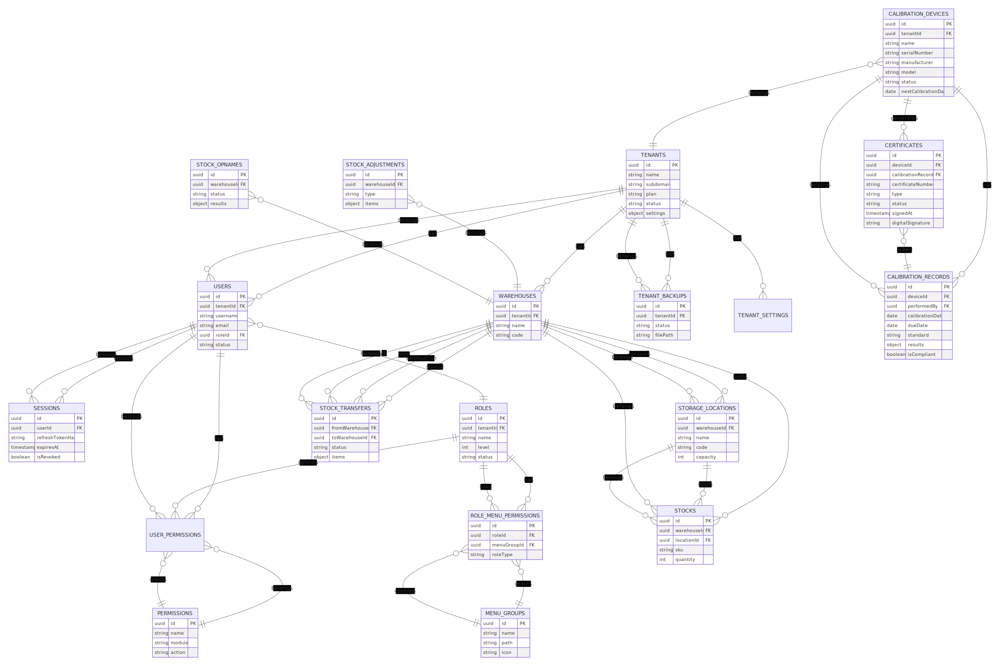

### Model Descriptions

| Model                     | Table                     | Description               | Key Fields                                                                                 |
| ------------------------- | ------------------------- | ------------------------- | ------------------------------------------------------------------------------------------ |
| **Tenant**                | `tenants`                 | Organizations/tenants     | name, subdomain, plan, status, settings(JSON)                                              |
| **User**                  | `users`                   | Individual users          | tenantId, username, email, passwordHash, roleId, status, virtual attributes (picture, first_name, last_name) |
| **Role**                  | `roles`                   | RBAC roles                | tenantId, name (SUPERADMIN, HEALTHCARE ADMIN, etc.), description                           |
| **MenuGroup**             | `menu_groups`             | Navigation groups         | name (User Management, Role Management, etc.), path                                        |
| **RoleMenuPermission**    | `role_menu_permissions`   | Role↔Menu read/write      | roleId, menuGroupId, roleType (read/write)                                                 |
| **UserMenuPermission**    | `user_menu_permissions`   | Per-user overrides        | userId, menuGroupId, permissionType (read/write/none — "none" is explicit deny)            |
| **Session**               | `sessions`                | Auth sessions             | userId, refreshTokenHash, expiresAt, userAgent, ip                                         |
| **Warehouse**             | `warehouses`              | Physical warehouses       | tenantId, name, code, address                                                              |
| **StorageLocation**       | `storage_locations`       | Location within warehouse | warehouseId, name, code, capacity                                                          |
| **Stock**                 | `stocks`                  | Inventory per location    | warehouseId, locationId, sku, quantity                                                     |
| **StockTransfer**         | `stock_transfers`         | Inter-warehouse transfers | fromWarehouseId, toWarehouseId, status, items(JSON)                                        |
| **StockAdjustment**       | `stock_adjustments`       | Manual adjustments        | warehouseId, type (add/remove), items(JSON)                                                |
| **StockOpname**           | `stock_opnames`           | Periodic counting         | warehouseId, status, results(JSON)                                                         |
| **CalibrationDevice**     | `calibration_devices`     | Devices to calibrate      | tenantId, name, serialNumber, manufacturer, model, status, nextCalibrationDate             |
| **CalibrationRecord**     | `calibration_records`     | Calibration history       | deviceId, performedBy, calibrationDate, dueDate, standard, results(JSON), isCompliant      |
| **Certificate**           | `certificates`            | Digital certificates      | deviceId, calibrationRecordId, certificateNumber, type, status, signedAt, digitalSignature |
| **TenantBackup**          | `tenant_backups`          | Backup operations         | tenantId, status, filePath, createdAt                                                      |
| **TenantSettings**        | `tenant_settings`         | Per-tenant config         | tenantId, key, value(JSON)                                                                 |
| **Vendor**                | `vendors`                 | Labs and suppliers        | tenantId, name, type (CalibrationLab/PartsSupplier/Other), rating, status                  |
| **MaintenanceWorkOrder**  | `maintenance_work_orders` | CMMS work orders          | tenantId, deviceId, vendorId, assigneeId, type (Preventative/Breakdown/Repair), status (Open/InProgress/Completed/Cancelled), priority (Low→Critical) |
| **Notification**          | `notifications`           | User notifications        | tenantId, userId, type (SYSTEM/CALIBRATION/INVENTORY/MAINTENANCE), title, message, isRead  |
| **Subscription**          | `subscriptions`           | Tenant subscription       | tenantId, planId, billingCycle (Monthly/Annually), status                                  |
| **Invoice**               | `invoices`                | Billing invoices          | tenantId, subscriptionId, amount, status, issuedAt                                         |
| **AuditLog**              | `audit_logs`              | Immutable audit trail     | tenantId, userId, action (CREATE/UPDATE/DELETE/LOGIN/APPROVE/EXPORT), resourceType, changes(JSONB before/after) |
| **ApiKey**                | `api_keys`                | Scoped API keys           | tenantId, name, keyHash (sha256), keyPrefix (12 chars), scopes, lastUsedAt                 |
| **Webhook**               | `webhooks`                | Outbound endpoints        | tenantId, url, secret (HMAC), events, isActive                                             |
| **WebhookDelivery**       | `webhook_deliveries`      | Delivery attempts         | webhookId, event, status (pending/success/failed/exhausted), attempts, responseStatus      |
| **Attachment**            | `attachments`             | Polymorphic files         | tenantId, resourceType, resourceId, fileName, mimeType, sizeBytes, checksum (sha256)       |

### Tenant Isolation

All tenant-scoped tables include a `tenantId` foreign key. Every query automatically scopes to the authenticated user's tenant via the `auth` middleware, which extracts `tenantId` from the JWT payload.

### Safe User Attributes

When serializing user data for authentication, profile updates, or user creation/editing endpoints, the system returns a standardized set of "safe" attributes to the client. This ensures that sensitive information is omitted and that consistent camelCase and snake_case representations are provided:

- `username` (string): The unique login username.
- `email` (string): The user's primary email address.
- `first_name` (string): The user's first name (snake_case alias).
- `last_name` (string): The user's last name (snake_case alias).
- `firstName` (string): The user's first name (camelCase).
- `lastName` (string): The user's last name (camelCase).
- `picture` (string): Full URL to the user's avatar picture, dynamically resolved using `process.env.HOST_URL` and the profile upload directory.
- `avatarUrl` (string): Duplicate representation of the avatar URL for compatibility.

---

## API Architecture

### Route Organization

| Module                  | Base Path                            | File                                  | Controller                            |
| ----------------------- | ------------------------------------ | ------------------------------------- | ------------------------------------- |
| **Auth**                | `/api/v1/auth/*`                     | `routes/api/auth.js`                  | `auth.controller.js`                  |
| **Users**               | `/api/v1/users/*`                    | `routes/api/user.js`                  | `user.controller.js`                  |
| **Roles**               | `/api/v1/roles/*`                    | `routes/api/roles.js`                 | `roles.controller.js`                 |
| **Tenants**             | `/api/v1/tenants/*`                  | `routes/api/tenant.js`                | `tenant.controller.js`                |
| **Sessions**            | `/api/v1/sessions/*`                 | `routes/api/session.js`               | `session.controller.js`               |
| **TenantBackup**        | `/api/v1/tenants/:id/backups/*`      | `routes/api/tenantBackup.js`          | `tenantBackup.controller.js`          |
| **CalibrationDevices**  | `/api/v1/calibration-devices/*`      | `routes/api/calibrationDevices.js`    | `calibrationDevices.controller.js`    |
| **CalibrationRecords**  | `/api/v1/calibration-records/*`      | `routes/api/calibrationRecords.js`    | `calibrationRecords.controller.js`    |
| **CalibrationScheduler**| `/api/v1/calibration-scheduler/*`    | `routes/api/calibrationScheduler.js`  | `calibrationScheduler.controller.js`  |
| **Certificates**        | `/api/v1/certificates/*`             | `routes/api/certificates.js`          | `certificate.controller.js`           |
| **Stock**               | `/api/v1/stock/*`                    | `routes/api/stock.js`                 | `stock.controller.js`                 |
| **Warehouse**           | `/api/v1/warehouse/*`                | `routes/api/warehouse.js`             | `warehouse.controller.js`             |
| **Dashboard**           | `/api/v1/dashboard/*`                | `routes/api/dashboard.js`             | `dashboard.controller.js`             |
| **UserPermissions**     | `/api/v1/user-permissions/*`         | `routes/api/userPermissions.js`       | `userPermission.controller.js`        |
| **MenuGroups**          | `/api/v1/menu-groups/*`              | `routes/api/menuGroups.js`            | `menuGroup.controller.js`             |
| **Vendors**             | `/api/v1/vendors/*`                  | `routes/api/vendor.js`                | `vendor.controller.js`                |
| **Maintenance**         | `/api/v1/maintenance/*`              | `routes/api/maintenance.js`           | `maintenance.controller.js`           |
| **Notifications**       | `/api/v1/notifications/*`            | `routes/api/notifications.js`         | `notification.controller.js`          |
| **Billing**             | `/api/v1/billing/*`                  | `routes/api/billing.js`               | `billing.controller.js`               |
| **Quota**               | `/api/v1/quota/*`                    | `routes/api/quota.js`                 | `quota.controller.js`                 |
| **Audit**               | `/api/v1/audit/*`                    | `routes/api/audit.js`                 | `audit.controller.js`                 |
| **ApiKeys**             | `/api/v1/api-keys/*`                 | `routes/api/apiKeys.js`               | `apiKey.controller.js`                |
| **Webhooks**            | `/api/v1/webhooks/*`                 | `routes/api/webhooks.js`              | `webhook.controller.js`               |
| **Reports**             | `/api/v1/reports/*`                  | `routes/api/reports.js`               | `reporting.controller.js`             |
| **Search**              | `/api/v1/search`                     | `routes/api/search.js`                | `search.controller.js`                |
| **Attachments**         | `/api/v1/attachments/*`              | `routes/api/attachments.js`           | `attachment.controller.js`            |
| **Migration**           | `/api/v1/migration/*`                | `routes/internal/migration.js`        | `migration.controller.js`             |

### Health Check Endpoints

| Endpoint      | Description                 |
| ------------- | --------------------------- |
| `GET /`       | API status check            |
| `GET /health` | Database connectivity check |
| `GET /ready`  | Kubernetes readiness probe  |
| `GET /live`   | Kubernetes liveness probe   |

### Documentation Endpoints

| Endpoint         | Description                          |
| ---------------- | ------------------------------------ |
| `/docs`          | Swagger UI interactive documentation |
| `/documentation` | HTML documentation                   |

---

## Authentication & Authorization

### JWT Token Flow

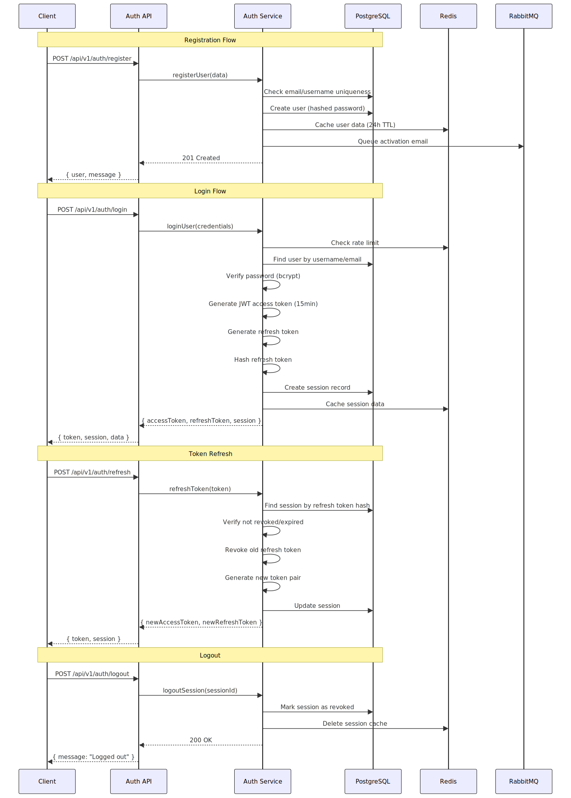

### System Architecture Overview



### RBAC & ABAC Authorization



### Database Schema (ER Diagram)


### Middleware Pipeline



### API Endpoints Reference



### Multi-Tenancy Architecture



### Backup & Logging System



### Security Layers



### Project Structure



### Docker Architecture



### Menu Group Architecture



### User Menu Resolution Flow

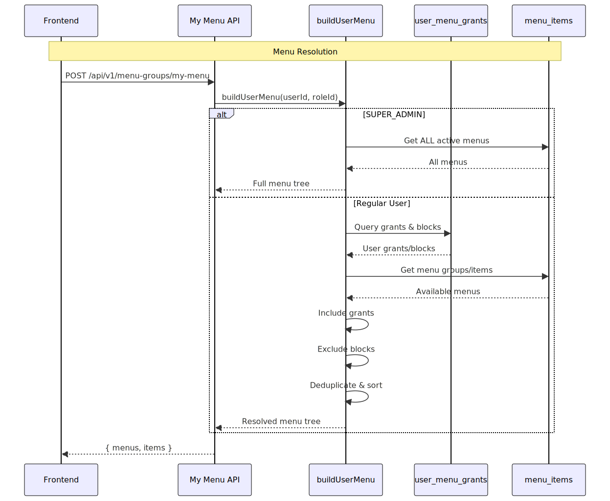

### Authorization Layers

Authorization is resolved in four layers, evaluated in order:

1. **JWT Authentication** (`auth.js`): Validates access token, loads user + session context.
2. **RBAC** (`rbac.js`): Checks user's static role against required permissions.
3. **Dynamic RBAC & Tenant Isolation** (`dynamicAccess.js`): Enforces role-based menu permissions using the `RoleMenuPermission` mapping and a cached permission matrix. It also handles tenant isolation checks dynamically (attribute-based scoping).
4. **Per-User Overrides** (`dynamicAccess.js` + `UserMenuPermission`): User-specific overrides are applied on top of role inheritance. A `permissionType` of `read` or `write` grants that access even if the role lacks it; `none` is an **explicit deny** that revokes access the role would otherwise grant. When both exist, the **user override always wins over the role permission**. Resolved overrides are cached per user in Redis under `permissions:user:{id}`.

#### User Permission Resolution

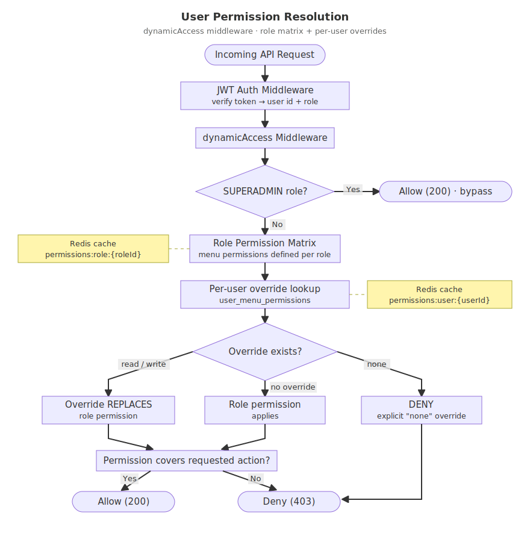

### API Key Authentication

As an alternative to JWT, requests can authenticate with a scoped API key (see [API Keys](#api-keys)). The raw key (`cbk_...`) is presented by the client, matched by its 12-character prefix, verified against its sha256 hash, and its scopes (`<Resource>:<read|write|*>` or `*`) are checked against the requested route at request time. API key management endpoints themselves are JWT-only.

### Permission Format

Permissions use `module:action` format:

- `User:read`, `User:create`, `User:update`, `User:delete`, `User:role-update`
- `Role:read`, `Role:create`, `Role:update`, `Role:delete`
- `Tenant:read`, `Tenant:create`, `Tenant:update`, `Tenant:delete`
- `Session:read`, `Session:revoke`
- `CalibrationDevice:read`, `CalibrationDevice:create`, etc.
- `Stock:read`, `Stock:create`, etc.

---

## Multi-Tenancy

### Tenant Model

Each tenant represents an organization with:

- **Plan tier** (free, professional, business, enterprise)
- **Feature flags** per plan level
- **Custom branding** (logo upload)
- **Settings** (key-value store via `TenantSettings`)

### Data Isolation

- All queries automatically scope by `tenantId`
- Middleware extracts tenant from JWT and binds to request context
- No cross-tenant data access possible

### Feature Flags

Tenants have features enabled/disabled based on their plan:

```javascript
{
  tenant: true,
  backup: true,
  stock: true,
  warehouse: true,
  calibration: true,
}
```

Plan-tier features (reports, webhooks, api_keys, sso, search, etc.) are additionally enforced at request time by the quota middleware — see [Billing & Quota](#billing--quota).

---

## Security Features

| Feature                | Implementation                                        |
| ---------------------- | ----------------------------------------------------- |
| **Password Hashing**   | bcrypt with configurable salt rounds                  |
| **JWT Secrets**        | Separate access and refresh secrets (required in env) |
| **API Key Storage**    | sha256 hash + 12-char prefix; raw key shown once      |
| **Webhook Signing**    | HMAC-SHA256 payload signatures                        |
| **XSS Protection**     | Global sanitizer strips HTML tags from input          |
| **HPP**                | Horizontal Request Pagination protection              |
| **CORS**               | Configurable allowed origins                          |
| **Helmet**             | Secure HTTP headers                                   |
| **Rate Limiting**      | Token bucket algorithm (Redis-backed)                 |
| **Account Lockout**    | 15-minute lock after failed login attempts            |
| **Session Revocation** | Forced logout on security events                      |
| **UUID Validation**    | All UUID parameters validated before controller       |
| **Virus Scanning**     | Attachment uploads scanned before storage             |

---

## Caching & Performance

### Redis Caching Strategy

| Cache Key Pattern            | TTL              | Purpose                          |
| ---------------------------- | ---------------- | -------------------------------- |
| `tenant:{subdomain}`         | 24 hours         | Tenant data (reduces DB queries) |
| `user:{id}`                  | 24 hours         | User data                        |
| `user:by-email:{email}`      | 24 hours         | Email lookup                     |
| `permission_matrix:{userId}` | 5 minutes        | RBAC permission matrix           |
| `permissions:user:{id}`      | 5 minutes        | Per-user permission overrides    |
| `token_bucket:{ip}:{route}`  | Sliding window   | Rate limiting                    |
| `session:cache:{sessionId}`  | Session lifetime | Session data                     |

### Database Optimization

- **Connection Pooling**: Sequelize configured with pool size from env
- **SSL**: Production databases use SSL/TLS
- **Retries**: Automatic query retry on connection failure
- **Timezone**: UTC storage with proper timezone configuration

---

## Queue & Email System

### RabbitMQ Email Queue

```
┌──────────┐     ┌──────────┐     ┌──────────┐     ┌──────────┐
│  Server   │────▶│  Rabbit  │────▶│  Worker  │────▶│  SMTP    │
│  (API)    │     │  MQ      │     │  Service │     │  Server  │
└──────────┘     └──────────┘     └──────────┘     └──────────┘
                     │
                     ├── Retry (exponential backoff)
                     └── DLQ on max retries
```

### Email Types

- **Account Activation**: Sent on user registration
- **OTP Verification**: Sent for password reset
- **Custom Templates**: Extensible for other email types

---

## Backup & Restore

### Tenant Backup Flow

```
┌──────────┐     ┌──────────┐     ┌──────────┐     ┌──────────┐
│  Request │────▶│  Validate│────▶│  pg_dump │────▶│  Store   │
│  Backup  │     │  Tenant  │     │  (SQL)   │     │  (S3/fs) │
└──────────┘     └──────────┘     └──────────┘     └──────────┘
                                              │
                                      ┌───────┴───────┐
                                      │  Update       │
                                      │  TenantBackup │
                                      │  status=done  │
                                      └───────────────┘
```

### Backup Features

- **Per-tenant**: Isolated backup per tenant
- **Status tracking**: pending → running → done/error
- **Restore**: Full tenant restore from backup
- **Download**: Backup file download
- **Statistics**: Backup count and size stats

---

## Session Management

### Session Model

Each session tracks:

- User ID, device info (userAgent), IP address
- Hashed refresh token (never stored plain)
- Expiration time, revoked status
- Active/inactive status

### Session Operations

- **Login**: Creates new session record
- **Logout**: Revokes single session
- **Logout All**: Revokes all user sessions
- **Session List**: Admin can view/revoke sessions
- **Auto-cleanup**: Cron job removes expired sessions

---

## Calibration System

### Device Lifecycle

The calibration system follows a complete lifecycle from device registration through calibration,
certificate generation, and record archiving. Devices are tracked with their serial numbers,
manufacturers, models, and next calibration dates.

#### Calibration Lifecycle Flow



### Certificate Types

- **calibration**: Standard calibration certificate
- **maintenance**: Maintenance completion certificate
- **verification**: Verification/inspection certificate

#### Certificate Lifecycle Flow



---

## Stock & Warehouse Management

### Warehouse Structure

Warehouses contain storage locations, which hold inventory items. Stock transfers move items
between warehouses, while stock adjustments allow manual corrections and periodic stock opname
counting ensures physical inventory matches records.

#### Stock Transfer Workflow

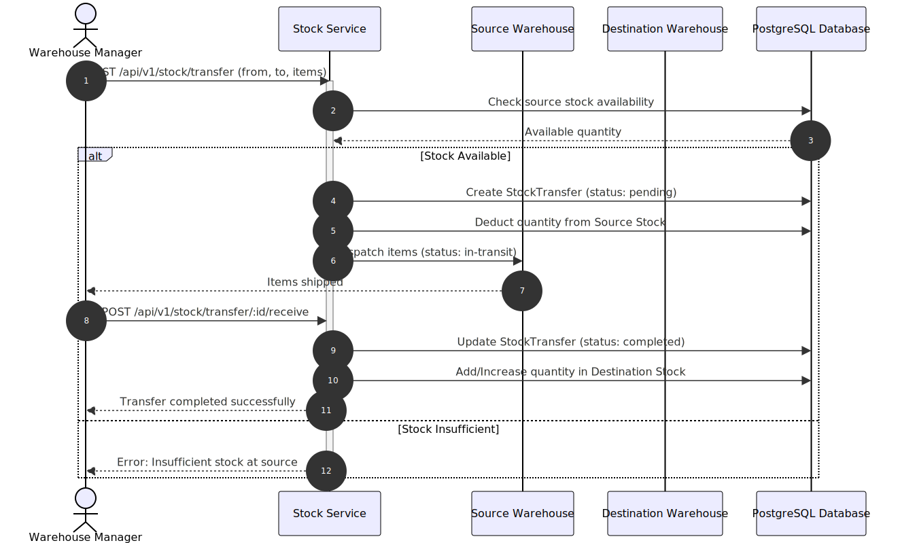

### Stock Operations

| Operation            | Description                    |
| -------------------- | ------------------------------ |
| **Stock Add**        | Increase stock at a location   |
| **Stock Remove**     | Decrease stock at a location   |
| **Stock Transfer**   | Move stock between warehouses  |
| **Stock Adjustment** | Manual correction (add/remove) |
| **Stock Opname**     | Periodic physical counting     |

---

## Additional Modules

### Dashboard Metrics

`GET /api/v1/dashboard/metrics` (`src/services/dashboard.service.js`) returns aggregated, tenant-scoped metrics in a single call:

- **Users**: total and active user counts
- **Devices**: total, due soon, and overdue calibration counts
- **Compliance**: calibration compliance rate
- **Certificates**: issued/active certificate counts
- **Inventory**: stock totals
- **Maintenance**: open work order backlog
- **Trends**: 6-month historical series for charting

SUPERADMIN receives a **global view** across all tenants plus a per-tenant breakdown; all other roles see only their own tenant.

### User Permission Overrides

Per-user permission overrides (`user_menu_permissions` table, model `UserMenuPermission`) sit on top of role inheritance:

- `permissionType` is one of `read`, `write`, or `none` — where `none` is an explicit deny
- Resolution order: **user override wins over role permission**
- Enforced inside the `dynamicAccess` middleware, with a per-user Redis cache (`permissions:user:{id}`)

| Method | Endpoint                                          | Access     |
| ------ | ------------------------------------------------- | ---------- |
| GET    | `/api/v1/user-permissions/:userId`                | SUPERADMIN |
| POST   | `/api/v1/user-permissions/:userId`                | SUPERADMIN |
| DELETE | `/api/v1/user-permissions/:userId/:menuGroupId`   | SUPERADMIN |

See [Authorization Layers](#authorization-layers) for the full 4-layer resolution flow.

### Vendors

`/api/v1/vendors` provides CRUD for third-party vendors (model `Vendor`):

- **Type**: `CalibrationLab`, `PartsSupplier`, or `Other`
- **Rating** and **status** tracking for supplier quality management
- Vendors are linked to maintenance work orders for outsourced work

### Maintenance (CMMS)

`/api/v1/maintenance` provides work order CRUD (model `MaintenanceWorkOrder`):

| Attribute    | Values                                        |
| ------------ | --------------------------------------------- |
| **Type**     | Preventative, Breakdown, Repair               |
| **Status**   | Open, InProgress, Completed, Cancelled        |
| **Priority** | Low, Medium, High, Critical                   |

Work orders relate to a calibration device, an optional vendor, and an optional assignee (user).

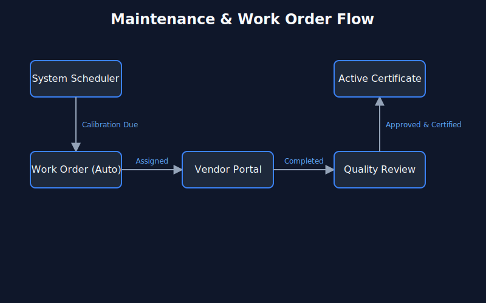

### Calibration Scheduler

`/api/v1/calibration-scheduler` automates preventative maintenance from calibration due dates:

- `GET /due` — lists devices due for calibration within a configurable `leadDays` window
- `POST /run` — runs an **idempotent** scan that creates `Preventative` maintenance work orders for due devices, emits notifications, and publishes webhook events (e.g. `device.calibration_due`). A device that already has an Open/InProgress preventative work order is skipped. SUPERADMIN can run the scan cross-tenant.

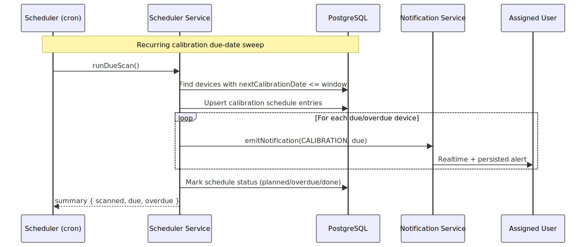

### Notifications & Realtime

`/api/v1/notifications` is the in-app notification center:

- List notifications (with unread count in `meta`), mark one read, mark all read, delete
- Notification types: `SYSTEM`, `CALIBRATION`, `INVENTORY`, `MAINTENANCE`

Realtime delivery uses **socket.io** (`src/config/socket.js`):

- Default namespace; handshake authenticates with a **short-lived socket JWT** obtained from `POST /api/v1/auth/socket-token` (5-minute TTL). This exists because the app JWT lives in an httpOnly cookie, which browser JavaScript cannot read.
- On connect, the socket joins rooms `tenant_{id}` and `user_{id}`
- New notifications are pushed as the `new_notification` event

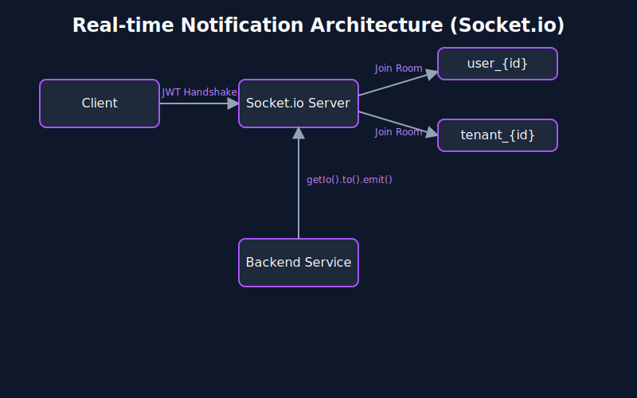

### Billing & Quota

`/api/v1/billing` manages the tenant subscription:

- `GET`/`PATCH` subscription — `planId`, `billingCycle` (`Monthly`/`Annually`), `status`
- `GET` invoices — billing history
- `POST /webhook` — Stripe webhook endpoint with signature verification (`stripeWebhook.service.js`)

`/api/v1/quota` reports usage against the plan:

- `GET` usage summary — current plan, features unlocked by plan tier (`free` → `professional` → `business` → `enterprise`), seats used/limit, storage usedMb/limitMb

Quota is enforced by middleware (`enforceQuota.js`):

- `requireFeature` — returns **402 Payment Required** when the plan lacks a feature
- `enforceStorageQuota` — returns **413 Payload Too Large** when an upload would exceed the storage quota

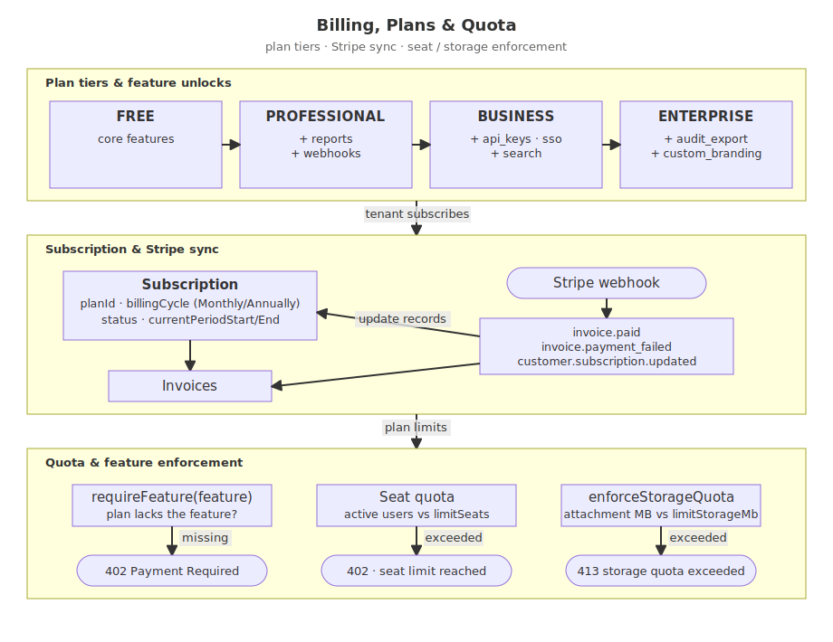
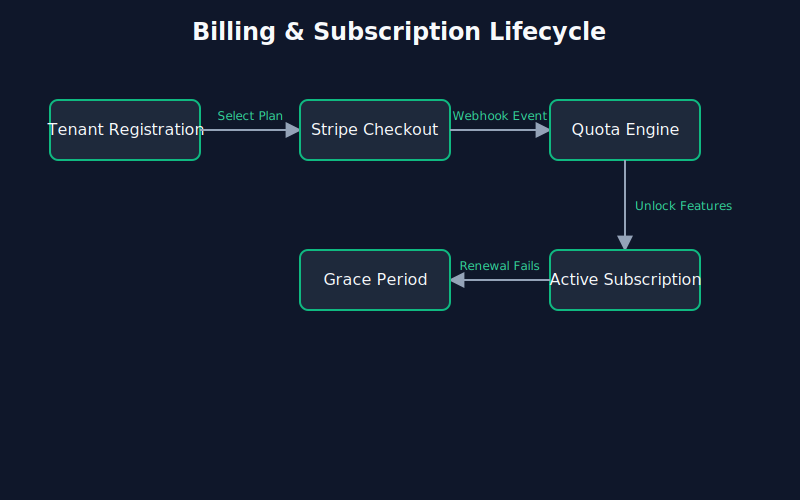

### Audit Logs

`GET /api/v1/audit` exposes the **immutable** audit trail (FDA 21 CFR Part 11 compliant):

- Filters: `userId`, `action`, `resourceType`, and date range
- Actions: `CREATE`, `UPDATE`, `DELETE`, `LOGIN`, `APPROVE`, `EXPORT`
- Each entry stores `changes` as JSONB with before/after snapshots

Audit entries can never be updated or deleted through the API.

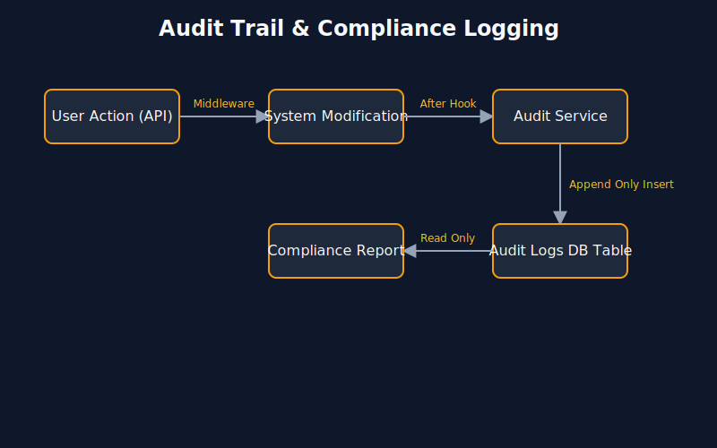

### API Keys

`/api/v1/api-keys` manages scoped API keys for machine-to-machine access:

- Management endpoints are **JWT-only** (an API key cannot manage API keys)
- The raw key (`cbk_...`) is returned **once** on creation; only a sha256 hash and a 12-character prefix are stored
- Scopes use the format `<Resource>:<read|write|*>` or `*` for full access
- Scopes are checked against the requested route at request time

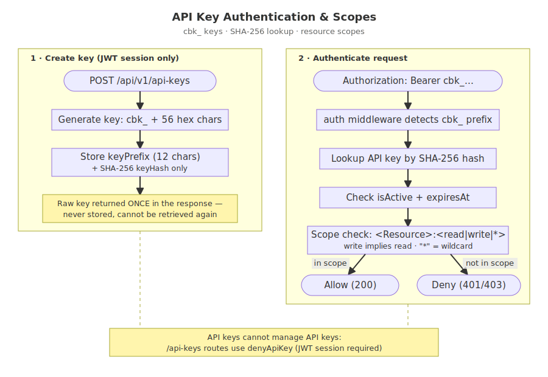

### Webhooks

`/api/v1/webhooks` provides outbound event delivery:

- CRUD for webhook endpoints, plus `GET /:id/deliveries` (delivery history) and `POST /:id/test`
- Payloads are signed with **HMAC-SHA256** and sent with the `X-Webhook-Signature` header
- Delivery retries with exponential backoff — up to 5 attempts, 8-second request timeout
- Delivery statuses: `pending` → `success` / `failed` / `exhausted`
- Event subscriptions, e.g. `device.calibration_due`, `device.overdue`, or `*` for all events

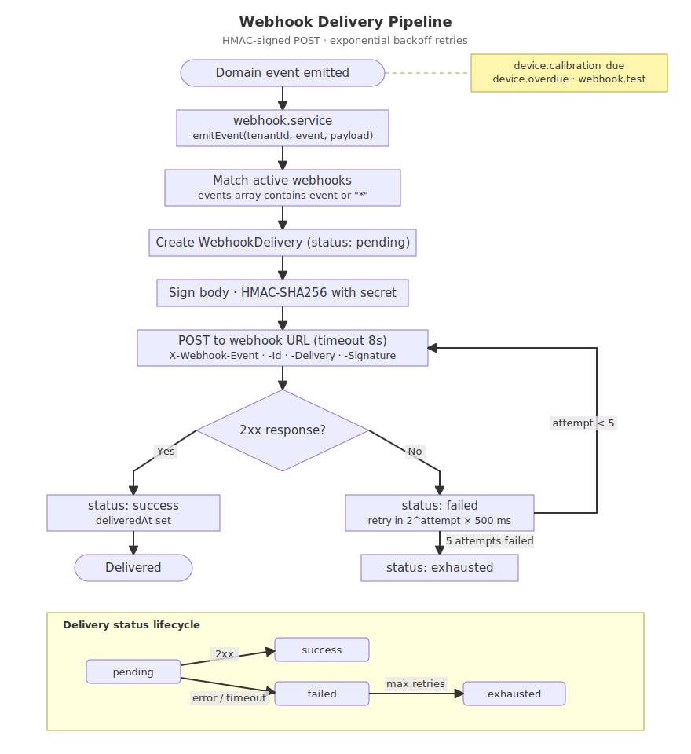

### Reports

`GET /api/v1/reports/*` generates operational and compliance reports:

| Endpoint                            | Report                              | CSV Export |
| ----------------------------------- | ----------------------------------- | ---------- |
| `/reports/summary`                  | Overall tenant summary              | —          |
| `/reports/compliance`               | Calibration compliance              | `?format=csv` |
| `/reports/calibration-workload`     | Upcoming calibration workload       | —          |
| `/reports/overdue-devices`          | Devices overdue for calibration     | `?format=csv` |
| `/reports/inventory`                | Inventory levels                    | `?format=csv` |

### Global Search

`GET /api/v1/search?q=&types=&limit=` performs a ranked global search:

- Backed by Postgres full-text search (`search_vector` columns with GIN indexes), with an ILIKE fallback
- Searches devices, stocks, and certificates; `types` filters the resource types
- Results are relevance-ranked

### Attachments

`/api/v1/attachments` handles file attachments for any resource:

- **Upload**: multipart, 25 MB limit, virus-scanned, sha256 checksum computed on ingest
- **Polymorphic**: attached via `resourceType`/`resourceId` (devices, work orders, etc.)
- **Download**: signed URLs using an HMAC token with a 300-second TTL
- **Quota**: uploads count against the tenant storage quota (413 when exceeded)

---

## API Response Format

### Success Response

```json
{
  "success": true,
  "status": 200,
  "message": "Operation successful",
  "data": { ... }
}
```

### Paginated Response

```json
{
  "success": true,
  "status": 200,
  "message": "Success",
  "data": [ ... ],
  "meta": {
    "total": 100,
    "page": 1,
    "limit": 20,
    "totalPages": 5
  }
}
```

### Error Response

```json
{
  "success": false,
  "status": 400,
  "message": "Error description",
  "errors": [ ... ]
}
```

---

## Middleware Pipeline

### Request Processing Order

```
Incoming Request
    │
    ├── globalSanitizer     → XSS protection
    ├── tokenRateLimiter    → Rate limiting
    ├── auth                → JWT validation (or API key + scope check)
    ├── dynamicAccess       → Permission check (role matrix + user overrides)
    ├── enforceQuota        → Plan feature / storage quota enforcement
    ├── inputValidation     → Joi schema validation
    ├── upload              → File upload handling
    │
    ├── [Controller]        → Business logic
    │
    ├── activityLog         → Activity tracking
    ├── auditLog            → Audit trail
    │
    └── errorHandlers       → Error handling
```

---

## Error Handling

### Custom Error Class

```javascript
class AppError {
  constructor(message, statusCode) {
    this.statusCode = statusCode;
    this.success = false;
  }
}
```

### Error Types

| Error                | Status       | Description                    |
| -------------------- | ------------ | ------------------------------ |
| `AppError`           | Configurable | Base application error         |
| Sequelize Validation | 400          | Database constraint violations |
| JWT Error            | 401          | Invalid/expired tokens         |
| Payment Required     | 402          | Plan lacks the required feature |
| Not Found            | 404          | Resource not found             |
| Payload Too Large    | 413          | Storage quota exceeded         |
| Generic Error        | 500          | Internal server error          |

---

## Logging

### Winston Configuration

- **Transport**: File-based with daily rotation
- **Format**: JSON structured logging
- **Levels**: error, warn, info, http, debug
- **Rotation**: Daily with retention policy

### Log Categories

- **HTTP**: Request/response logging
- **Error**: Application errors with stack traces
- **Database**: Query timing and errors
- **Security**: Auth failures, rate limit events
- **Activity**: User activity tracking

---

## Testing

### Test Structure

```
tests/
├── controllers/     # Controller unit tests
├── middlewares/     # Middleware tests
├── services/        # Service layer tests
├── utils/           # Utility function tests
├── validators/      # Validator tests
└── test.utils.js    # Test utilities
```

### Running Tests

```bash
npm test
```

---

## Deployment

### Docker Deployment

```bash
# Build and run with Docker Compose
docker-compose up -d

# Services started:
# - PostgreSQL (port 5432)
# - Redis (port 6379)
# - RabbitMQ (port 5672, 15672)
# - Backend API (port 5000)
```

### Required Environment Variables

| Variable             | Description                  | Required |
| -------------------- | ---------------------------- | -------- |
| `JWT_ACCESS_SECRET`  | Access token signing secret  | **Yes**  |
| `JWT_REFRESH_SECRET` | Refresh token signing secret | **Yes**  |
| `DB_HOST`            | PostgreSQL host              | Yes      |
| `DB_PORT`            | PostgreSQL port              | Yes      |
| `DB_NAME`            | Database name                | Yes      |
| `DB_USER`            | Database user                | Yes      |
| `DB_PASS`            | Database password            | Yes      |
| `REDIS_URL`          | Redis connection URL         | Yes      |
| `AMQP_URL`           | RabbitMQ connection URL      | Optional |
| `ACCESS_LOG_PATH`    | Log file path                | Yes      |
| `ERROR_LOG_PATH`     | Error log file path          | Yes      |

---

## Development

### Local Development

```bash
npm run dev
```

### Available Scripts

| Command                    | Description                     |
| -------------------------- | ------------------------------- |
| `npm run dev`              | Development server with nodemon |
| `npm start`                | Production server               |
| `npm test`                 | Jest test suite                 |
| `npm run swagger:generate` | Generate swagger.json           |
| `npm run build`            | Package executable (Bun)        |

---

## License

MIT
